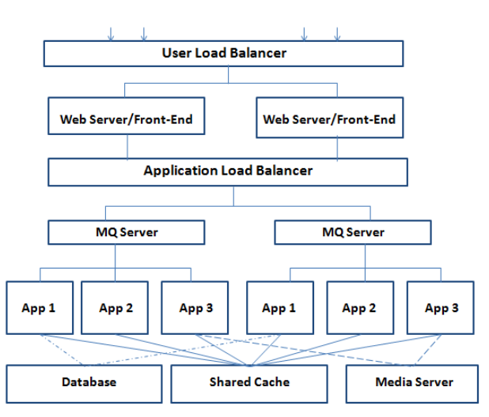

# Turing.ly Shopmate

## Table Of Contents
- [1. Introduction](#1-introduction)
- [2. Architecture](#2-architecture)
- [3. API Documentation](#3-api-documentation)
- [4. Errors](#4-errors)
- [5. Installing](#5-installing)
- [6. Testing](#6-testing)
- [7. Advanced Requirements](#7-advanced-requirements)
- [8. Deployment](#8-deployment)

### 1. Introduction
This project is a backend implementation of ShopMate an ecommerce platform. It's part of turing.ly challenge for backend developers.
The technologies used are Nodejs & GraphQL for the API and MySQL for the database. I spent around **35 hours** working on this challenge.

### 2. Architecture
The backend is split modularly into modules by according to features. This seperation allows the app to be seperated into microservices architecture with ease when needed. 

### 3. API Documentation
The documentaion for Supported GraphQL Queries can be found after running the server at [http://localhost:4000/graphql](http://localhost:4000/graphql).

### 4. Errors
The errors returned from the API follow the same style in this [document](https://docs.google.com/document/d/1Du-9PZ-9Usgq6tRiWB4_bxXr4F4-Z5ZYT--EdZ14qbc/edit?usp=sharing). The list of predefined errors can be found in [`server/src/utils/errors.js`](https://github.com/melzareix/turing-challenge/blob/master/server/src/utils/errors.js)

### 5. Installing
1. You need to have `node 10` with `npm` or `yarn` and `MySQL 5.7`.
2. Clone this repo.
3. `cd server` and install dependencies using yarn `yarn`.
4. In the server directory create a new `.env` file with the following entries.
  ```
  MYSQL_HOST: Hostname for mysql-server.
  MYSQL_USER: MySQL Database User.
  MYSQL_PASS: MySQL Database User Password.
  MYSQL_DB: MySQL Database Name.
  JWT_KEY: JWT Secret Key.
  STRIPE_SECRET_KEY: Stripe Secret Key.
  SENDGRID_API_KEY: Sendgrid API Key.
  ```
5. Create and seed the MySQL database using `database/tshirtshop.sql` file.  
6. To run the server `yarn start`.

### 6. Testing
The API has 100% test coverage using Jest. To run the tests `yarn test`.

### 7. Advanced Requirements
1. **The current system can support 100,000 daily active users.How do you design a new system to support 1,000,000 daily active users?**

  We can use a micro-service message based architecture as shown in the figure below. The application will be split into microservices and we have a several running instances from the same microservice. A load balancer is used to balance the traffic between the instances. We use message queues to communicate between the different services or using the shared cache server. We can use Apollo GraphQL Fedration so the underlying client sees the whole graph as one schema without exposing the underlying seperation.

  

2. **A half of the daily active users comes from United States. How do you design a new system to handle this case?**

To handle this case it would be best if we use and base our servers in the United States so the latency to the users is smaller. We can also use a CDN for static assets that are US based.

### 8. Deployment
The API is currently deployed at [http://34.68.122.220:4000/graphql](http://34.68.122.220:4000/graphql). It's deployed using docker on GCP.
